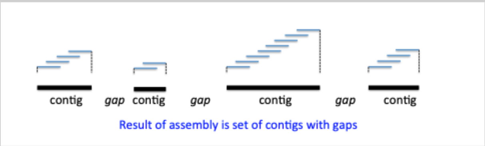

# Accelerating-Genomics
In this ReadMe I explore at an high level different domains of computation genomics.

### Preliminary definitions
* **Read Mapping**: The process of aligning short sequencing reads (obtained from DNA or RNA) to a known reference genome. Allows to find the position of the read in the reference genome.

* **Genome Assembly**: Reconstructing the complete genome sequence of an organism from short sequencing reads, obtained through shotgun sequencing, by puzzling all the reads together.

* **Shotgun sequencing**: break down the entire genome into random fragments, which are then sequenced.

* **Contigs**: Combinations of overlapping reads that represent contiguous sequences.

* **Reads**: Reads are short sequences of nucleotides (the building blocks of DNA or RNA) generated by DNA or RNA sequencing technologies.

* **K-mers**: Reads can be modeled using k-mers, which are short subsequences of a specific length (k).

#### Graphs

* **Hamiltonian Path and Cycle**:
    * In a graph (directed or undirected), a Hamiltonian path visits each vertex (node) exactly once. It does not necessarily use all the edges (connections between nodes).
    * A Hamiltonian cycle is a closed Hamiltonian path, meaning it starts and ends at the same node.

    * Finding Hamiltonian paths and cycles is a computationally difficult problem classified as NP-complete.

* **Eulerian Path and Cycle**:

    * An Eulerian path in a graph (directed or undirected) visits each edge exactly once, although it can revisit nodes multiple times.
    * An Eulerian cycle is a closed Eulerian path.

    * Unlike finding Hamiltonian paths, efficient algorithms exist to solve the Eulerian path problem.

* **De Bruijn Graph (DBG)**: The de Bruijn graph of a collection of k-mers is a representation of every k-mer as an edge between its (k-1) prefix and its (k-1) suffix.

### Genome assembly overview

Assembling the genome means reconstructing the sequence of DNA of an organism from the small reads that are given in output from high throughput sequencing.

The sequencing process leaves us with k-mers (with k that varies based on the chosen sequencing technology), that are used to find contigs. Contings are found by overlapping the k-mers.

The result of the assembly is a set of contigs with gaps. The amount of overlap required to connect two reads is important. The more overlap the better accuracy, however we loose in DNA coverage, because some kmers may not have enough overlap to be inserted in any contig.

Another aspect to take into account is the length k of the kmers. It is important that k is long enough so that it is highly probable that the kmer is unique in the genome (or in the specific genomic location)

E.g., each 3-mer has a very high frequency in the genome; but finding a given 50-mer multiple times is much less likely.

#### Methods for assembly

An important data structure for genome assembly is the De Bruijin Graph (DBG). The goal is to find an Eulerian path (visit all edges once) to reconstruct the genome (or at least a contig)!
Hierholzer’s algoritm can find a Eulerian path in linear time, i.e., O(E) (Other algorithms exist)

The DBG can be reduced in size by merging all nodes with identical labels (to have each node label only once), preserving edges, and (optionally), unambiguous paths (without diverging branches) can be compressed by uniting their nodes.

To obtain the DBG from the set of kmers resulting from the sequencing there is the Dr. Seuss-Ome
Greedy algorithm.

# Local Alignment:

Local alignment is a tecnique developed in the context of sequence alignment in the DNA domain. The goal of the tecnique is to identify regions of similarities between two sequences. These regions may represent evolutionary relationships.
Conversely, global alignment considers the entire length of both sequences. Both local and global alignment methods work in a similar fashion, the first is particularily useful when making comparison among very different sequences that may contain only small regions of similarity.

# Smith Waterman Gotoh

The original Smith Waterman algorithm seeks the local alignment that yields the highest score based on a predefined scoring scheme. This scoring scheme typically assigns positive values for matches between corresponding nucleotides (e.g., A aligning with A), negative values for mismatches (e.g., A aligning with G), and penalties for introducing gaps (insertions or deletions) in one sequence to better align with the other.
Gotoh extended in the 1980s the functionalities of the original algorithm by introducing the idea of affine gap penalty. While the original algorithm assigns always the same penalty to gaps, the modified one
penalises differently the initiation of a gap and the extension of an exsisting gap; in particular, extending a gap isn't as penalised as beginning one.
This approach better models the way mutations in biology happens, in fact it is more probable that a single longer gap is inserted in a sequence, rather than multiple smaller gaps. Moreover, it has been proven that the first amino acid or nucleotide inserted or deleted is more significant, from a biological point of view, than the subsequent ones. Since the extension of gaps is less penalised the algorithm discourages the introduction of unnecessary gaps in the alignment.

To further extend the algorithm in case of protein alignment, one could use variable scores for substitutions. The most used approach is the substitutional matrix, a matrix of size $alphabet * alphabet$ that associates to each pair of letters a score that is built based on the probability that that particular letter is replaced with another during the evolutionary process. So, a positive value in the Substitutional Matrix, means that the two letters are similar or identical and that they are frequently exchanged each other without notable loss of biological function. Hernikoff in 1992 has introduced the Blosum Matrix, one of the most used Substitutional Matrix.

# Inner working

The algorithm employs dynamic programming, a powerful technique for efficiently solving problems by breaking them down into smaller, overlapping subproblems.
It takes in input the two strings to align and the scoring weights.

* string s1
* string s2
* gap initiation penalty $\alpha$ (negative number)
* gap extension penalty $\beta$ (negative number)
* score for a match (positive number)
* score for a mismatch (negative number)

It creates three scoring matrixes called $d$, $p$, $q$.

* $d_{i, j}$ each cell rapresents the cost for the alignment of the prefixes up to that point (e.g. ($s1_0$ ... $s1_i$), ($s2_0$ ... $s2_i$))
* $p_{i, j}$ each cell rapresents the cost for the alignment of the prefixes (e.g. ($s1_0$ ... $s1_i$), ($s2_0$ ... $s2_i$)) up to that point, that end with a gap in s2
* $q_{i, j}$ each cell rapresents the cost for the alignment of the prefixes (e.g. ($s1_0$ ... $s1_i$), ($s2_0$ ... $s2_i$)) up to that point, that end with a gap in s1

#### The matrixes are initialized as follows

* $p_{0, j} = -\infty $, with j that ranges from 0 to the length of the s2
* $q_{i, 0} = -\infty $, with i that ranges from 0 to the length of the s1
* $d_{0, j} = 0$, with j that ranges from 0 to the length of the s2
* $d_{i, 0} = 0$, with i that ranges from 0 to the length of the s1

#### The matrixes are filled iteratively with this algorithm

Premise: the gap penalty is computed with the following formula, where k is the size of the gap:

$$ g(k) = \alpha + \beta k$$

Matrixes:

$p_{i,j} = \max(d_{i-1,j} + g(1), \quad p_{i-1,j} + \beta)$

$q_{i,j} = \max(d_{i,j-1} + g(1), \quad q_{i,j-1} + \beta)$

In case of matching nucleotides

$d_{i,j} = \max(d_{i-1,j-1} + \text{match score}, \quad p_{i,j},\quad q_{i,j})$

In case of mismatching nucleotides

$d_{i,j} = \max(d_{i-1,j-1} + \text{mismatch score}, \quad p_{i,j},\quad q_{i,j})$

### References Smith waterman part
Gotoh
http://rna.informatik.uni-freiburg.de/Teaching/index.jsp?toolName=Gotoh

Gotoh yt video
https://www.youtube.com/watch?v=NqYY0PJbD3s

Smith waterman
 Dynamic Gap Selector: A Smith Waterman Sequence Alignment Algorithm with Affine Gap Model Optimization.

smith waterman slides
https://helios2.mi.parisdescartes.fr/~lomn/Cours/BI/Material/gap-penalty-gotoh.pdf

### References general part
de Bruijn, N. G. (1946)
A combinatorial problem
Indagationes Mathematicae 49:758–764
(Note: “de Bruijn graphs” have independently been discovered/described by: Good, I. J. (1946) Normal recurring decimals, Journal of the London Mathematical Society 21(3):167–169)

Sohn J.-I. & Nam J.-W. (2018)
The present and future of de novo whole-genome assembly
Briefings in Bioinformatics 19(1):23–40

Li Z., et al. (2012)
Comparison of the two major classes of assembly algorithms: overlap–layout–consensus and de-bruijn-graph
Briefings in Functional Genomics 11(1):25–37
